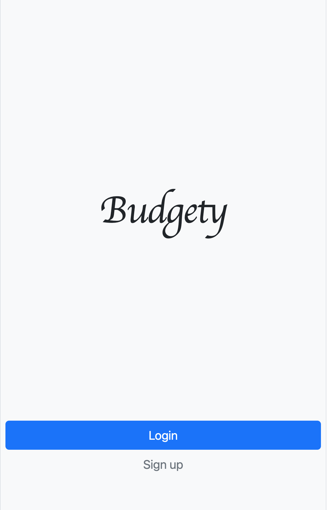
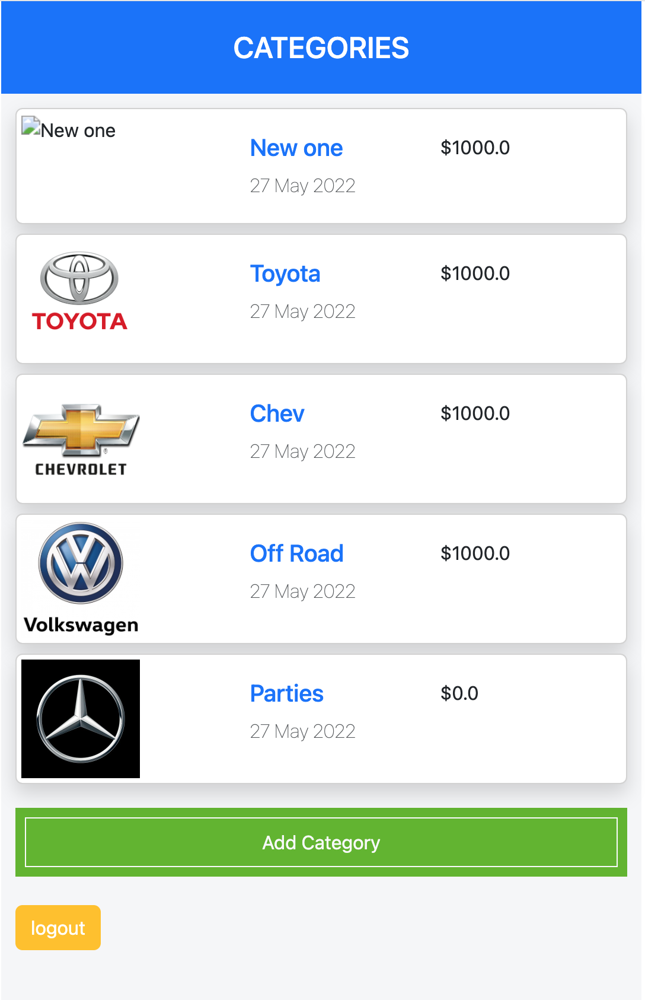

# RAILS BUDGETY APP

The Ruby on Rails capstone project is about building a mobile web application where I can manage my budget: I have a list of transactions associated with a category, so that I can see how much money I spent and on what.

I will create a Ruby on Rails application that allows the user to:

- register and log in, so that the data is private to them.
- introduce new transactions associated with a category.
- see the money spent on each category.

## Views

> | -   | Splash Page                        | -   | Categories                          | -   | Purchases                           | -   |
> | --- | ---------------------------------- | --- | ----------------------------------- | --- | ----------------------------------- | --- |
> | -   |  | -   | ) | -   | ) | -   |

## objectives

- Use ruby gems as software packages system.
- Install Ruby on Rails framework.
- Understand Rails RESTful design and router.
- Use controllers to handle requests and render empty views.
- Use params from browser request in a safe way.
- Use preprocessed html file with embedded Ruby code.
- Use layouts and templates for shared content.
- Use database migration files to maintain database schema.
- Use validations for models.
- Secure app from n+1 problems.
- Understand what ORM is.
- Write SQL queries with ActiveRecord.
- Set up associations between models.
- Build a webapp that requyoures the user to log in.
- Use devise gem for authentication.
- Limit access to webapp resources based on authorization rules.
- Analyze in writing why you have made a coding choice using one structure over another.

## Built With

- Ruby on Rails
- Gems
  - Rspec
  - Capybara
  - FactoryBot
  - Selenium-webdriver
  - Letter-opener
  - cancancan
  - Devise

## Getting Started

- Make sure you have Ruby installed in your system.
- I can install it [here](https://www.ruby-lang.org/en/documentation/installation/).

Clone this repository by running `https://github.com/billionsjoel/budgety.git` in your command line.

Navigate to the repository by running `cd budgety`.

## Installation

- Clone the repo and run `bundle install` in the command line to install the dependencies.
- run `rails s`

## Video link

`link to video: https://drive.google.com/file/d/1XTPb5Io7yJUponNJRVjrRYonRrP2dvJt/view?usp=sharing`

## Author

👤 **Atugonza Joel Billions**

- GitHub: [@billionsjoel](https://github.com/billionsjoel)
- LinkedIn: [Billionsjoel](https://www.linkedin.com/in/billionsjoel/)

## 🤝 Contributing

Contributions, issues, and feature requests are welcome!

Feel free to check the [issues page](https://github.com/billionsjoel/budgety/issues).

## Show your support

Give a ⭐️ if I like this project!

## Acknowledgments

- Coding partner, Standup and morning session team
